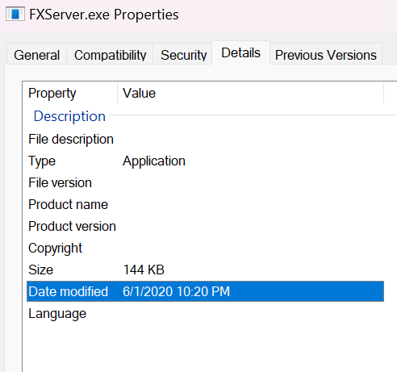

> **Note** I haven't fully uploaded the contents of the server yet due to copyrighted materials and sensetive data being present within these files which i need to remove before i can upload those specific parts of the project.

> **Warning** I've uploaded the contents of this repository not for you to run a server based on it, you shouldn't anyway sids a lot of code is outdated or insecure.

# OG Qbus
This is a the original copy of the qbus server including the qbus framework. All the contents of the *server* folder are untouched since there was last worked on the project.

I've decided to upload the project due to the commotion and discussion around the project about who the authors are, whether or not the project is based on the esx project, etc. The main purpose of this repo is to get answers to the questions that people have about the project.

## Project Age
The files within the project date back to June 1 of 2020 as stated by the date on which the FXServer.exe file was last modified.

